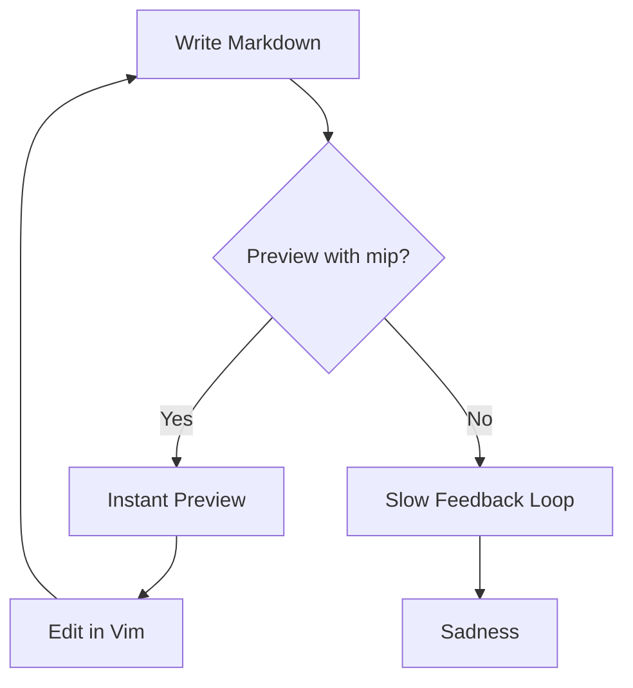
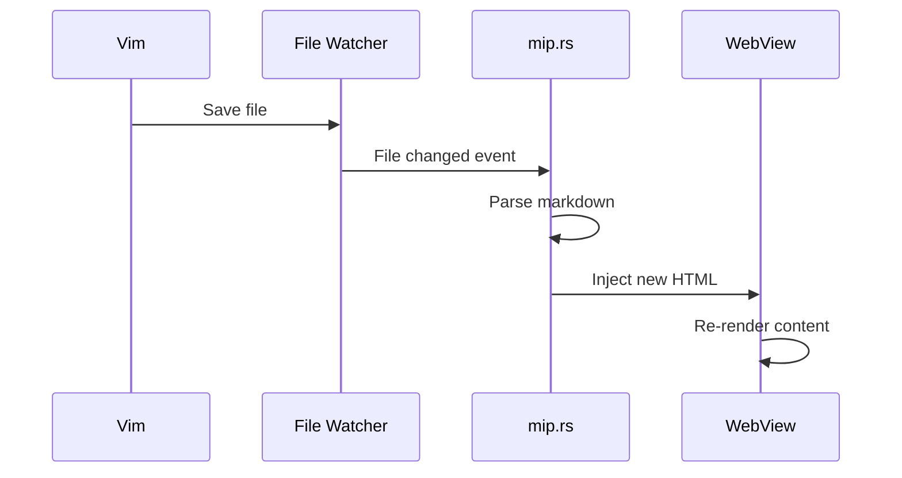
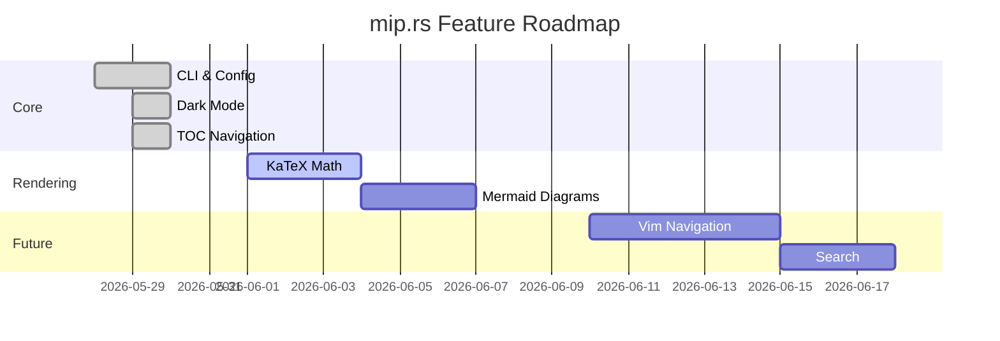
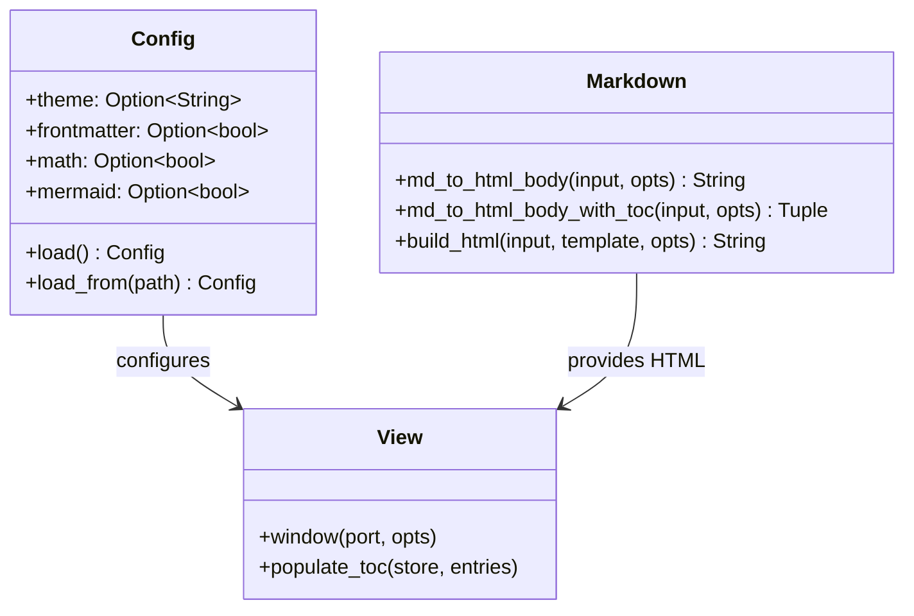
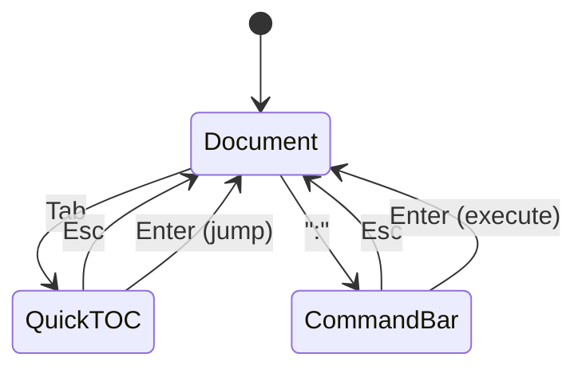
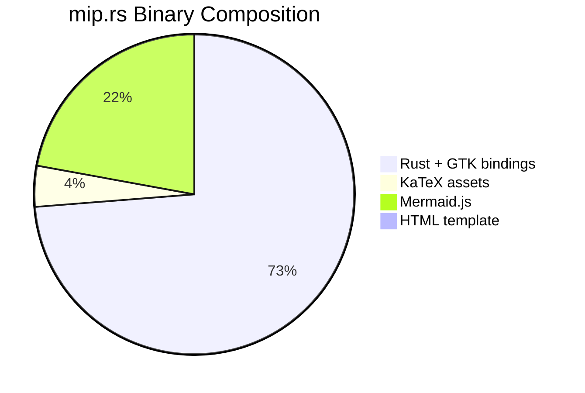
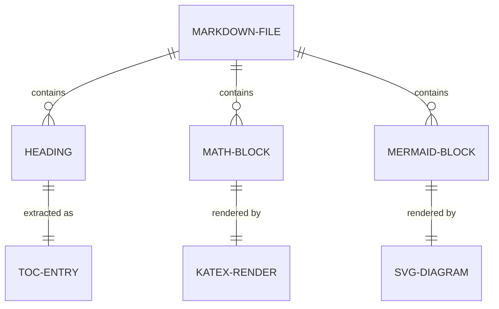
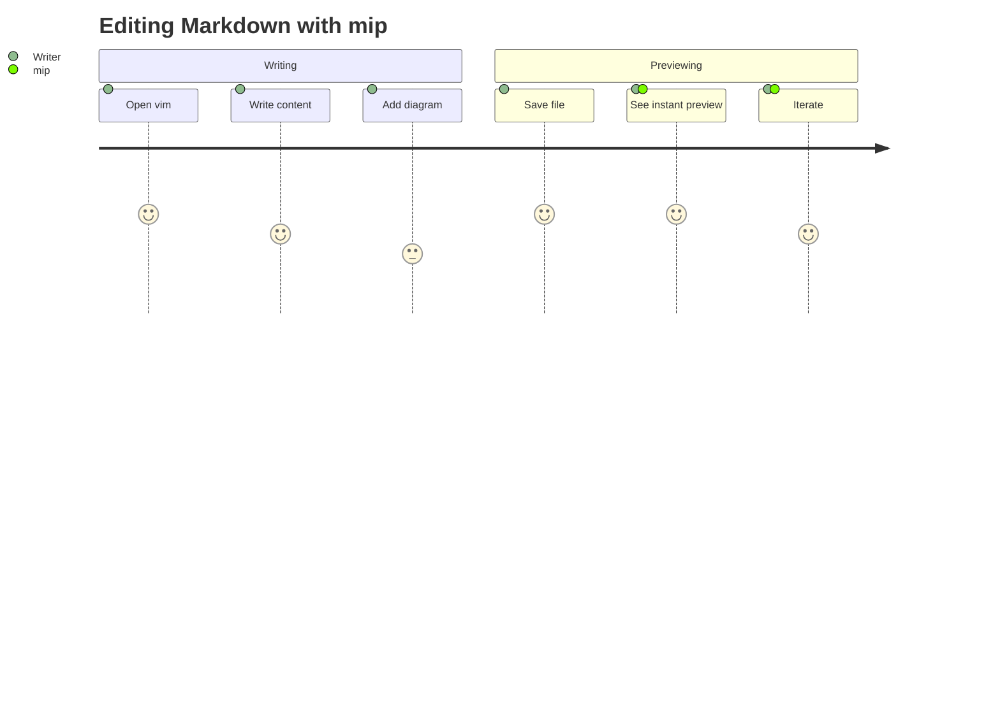

# Mermaid Diagrams in Markdown

## Flowchart

```mermaid
graph TD
    A[Write Markdown] --> B{Preview with mip?}
    B -->|Yes| C[Instant Preview]
    B -->|No| D[Slow Feedback Loop]
    C --> E[Edit in Vim]
    E --> A
    D --> F[Sadness]
```

## Sequence Diagram

```mermaid
sequenceDiagram
    participant V as Vim
    participant F as File Watcher
    participant M as mip.rs
    participant W as WebView

    V->>F: Save file
    F->>M: File changed event
    M->>M: Parse markdown
    M->>W: Inject new HTML
    W->>W: Re-render content
```

## Gantt Chart

```mermaid
gantt
    title mip.rs Feature Roadmap
    dateFormat YYYY-MM-DD
    section Core
        CLI & Config       :done, 2026-05-28, 2d
        Dark Mode          :done, 2026-05-29, 1d
        TOC Navigation     :done, 2026-05-29, 1d
    section Rendering
        KaTeX Math         :active, 2026-06-01, 3d
        Mermaid Diagrams   :2026-06-04, 3d
    section Future
        Vim Navigation     :2026-06-10, 5d
        Search             :2026-06-15, 3d
```

## Class Diagram

```mermaid
classDiagram
    class Config {
        +theme: Option~String~
        +frontmatter: Option~bool~
        +math: Option~bool~
        +mermaid: Option~bool~
        +load() Config
        +load_from(path) Config
    }
    class Markdown {
        +md_to_html_body(input, opts) String
        +md_to_html_body_with_toc(input, opts) Tuple
        +build_html(input, template, opts) String
    }
    class View {
        +window(port, opts)
        +populate_toc(store, entries)
    }
    Config --> View : configures
    Markdown --> View : provides HTML
```

## State Diagram

```mermaid
stateDiagram-v2
    [*] --> Document
    Document --> QuickTOC : Tab
    QuickTOC --> Document : Esc
    QuickTOC --> Document : Enter (jump)
    Document --> CommandBar : ":"
    CommandBar --> Document : Esc
    CommandBar --> Document : Enter (execute)
```

## Pie Chart

```mermaid
pie title mip.rs Binary Composition
    "Rust + GTK bindings" : 5000
    "KaTeX assets" : 280
    "Mermaid.js" : 1500
    "HTML template" : 30
```

## ER Diagram

```mermaid
erDiagram
    MARKDOWN-FILE ||--o{ HEADING : contains
    MARKDOWN-FILE ||--o{ MATH-BLOCK : contains
    MARKDOWN-FILE ||--o{ MERMAID-BLOCK : contains
    HEADING ||--|| TOC-ENTRY : "extracted as"
    MATH-BLOCK ||--|| KATEX-RENDER : "rendered by"
    MERMAID-BLOCK ||--|| SVG-DIAGRAM : "rendered by"
```

## Journey Map

```mermaid
journey
    title Editing Markdown with mip
    section Writing
        Open vim: 5: Writer
        Write content: 4: Writer
        Add diagram: 3: Writer
    section Previewing
        Save file: 5: Writer
        See instant preview: 5: Writer, mip
        Iterate: 4: Writer, mip
```
